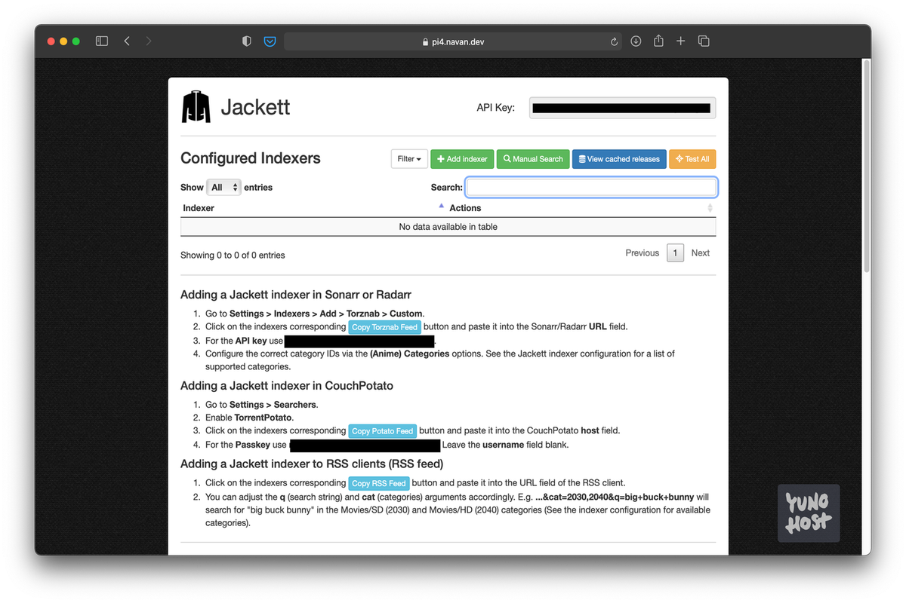

<!--
N.B.: Aquest README ha estat generat automàticament per <https://github.com/YunoHost/apps/tree/master/tools/readme_generator>
NO s'ha de modificar manualment.
-->

# Jackett per YunoHost

[](https://ci-apps.yunohost.org/ci/apps/jackett/)


[](https://install-app.yunohost.org/?app=jackett)

*[Llegeix aquest README en altres idiomes.](./ALL_README.md)*

> *Aquest paquet et permet instal·lar Jackett de forma ràpida i senzilla en un servidor YunoHost.*  
> *Si no tens YunoHost, consulta [la guia](https://yunohost.org/install) per saber com instal·lar-lo.*

## Visió general

Jackett works as a proxy server: it translates queries from apps (Sonarr, Radarr, SickRage, CouchPotato, Mylar3, Lidarr, DuckieTV, qBittorrent, Nefarious etc.) into tracker-site-specific http queries, parses the html or json response, and then sends results back to the requesting software. This allows for getting recent uploads (like RSS) and performing searches. Jackett is a single repository of maintained indexer scraping & translation logic - removing the burden from other apps.


**Versió inclosa:** 0.22.1705~ynh1

## Captures de pantalla



## Documentació i recursos

- Repositori oficial del codi de l'aplicació: <https://github.com/Jackett/Jackett>
- Botiga YunoHost: <https://apps.yunohost.org/app/jackett>
- Reportar un error: <https://github.com/YunoHost-Apps/jackett_ynh/issues>

## Informació per a desenvolupadors

Envieu les pull request a la [branca `testing`](https://github.com/YunoHost-Apps/jackett_ynh/tree/testing).

Per provar la branca `testing`, procedir com descrit a continuació:

```bash
sudo yunohost app install https://github.com/YunoHost-Apps/jackett_ynh/tree/testing --debug
o
sudo yunohost app upgrade jackett -u https://github.com/YunoHost-Apps/jackett_ynh/tree/testing --debug
```

**Més informació sobre l'empaquetatge d'aplicacions:** <https://yunohost.org/packaging_apps>
